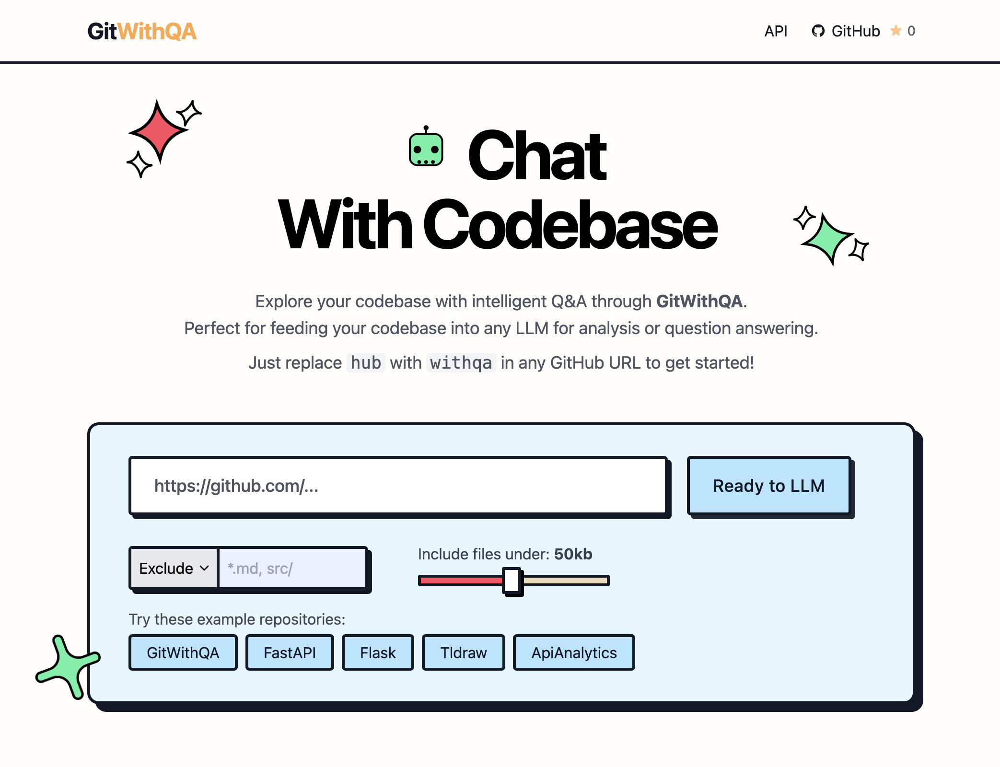

[](https://gitwithqa.com)

<!-- License -->
<a href="https://github.com/raselmeya94/gitwithqa/blob/main/LICENSE">
  
</a>


<!-- GitHub issues -->
<a href="https://github.com/raselmeya94/gitwithqa/issues">
  
</a>
<!-- Black code style -->
<a href="https://github.com/psf/black">
  
</a>

<!-- Discord -->
<a href="https://discord.com/invite/zerRaGK9EC">
  
</a>


# GitWithQA

**GitWithQA** enhances any GitHub repository by turning it into an interactive, intelligent **Q\&A knowledge base**—perfect for developers, teams, and LLM applications.

Now supercharged with **LLM chat integration**, GitWithQA allows users to **ask questions, explore code, and discuss functionality directly within the platform**—no extra setup required. Whether you're trying to understand what a specific file does, what a function is responsible for, or simply exploring the codebase, GitWithQA makes it seamless and intuitive.

🔗 **Try it live**: [gitwithqa.com](https://gitwithqa.com)
✨ **Shortcut**: Just replace `hub` with `withqa` in any GitHub URL to get instant Q\&A insights!

---

## 🚀 What’s New

* 💬 **Interactive LLM Chat**: Instantly ask questions and get answers from the full merged repository content. Perfect for code understanding, documentation lookup, and general discussion.
* 🔎 **Smart Context Awareness**: Get meaningful answers based on function roles, file responsibilities, and more.
* 🎯 **RAG Integration (Coming Soon)**: Enhanced **Retrieval-Augmented Generation** will ensure even more **accurate, context-aware answers** to your queries.
* 📦 **Powered by gitingest**: Leverages gitingest's structured file merge and preprocessing to enable deep understanding across the codebase.

---

## 🔧 Core Features

* 🔍 Extracts Q\&A pairs from code, docstrings, markdown, and comments
* 🧠 Chat-ready interface for real-time conversation with your repo
* ⚙️ Token-aware chunking using [`tiktoken`](https://github.com/openai/tiktoken)
* 🧱 Built to integrate into any RAG pipeline
* 🌐 Frontend with Tailwind CSS
* ⚡ FastAPI backend
* 📊 Usage analytics via [APIAnalytics.dev](https://apianalytics.dev)

---


## 🛠 Tech Stack

| Layer      | Technology         |
|------------|--------------------|
| Frontend   | Tailwind CSS       |
| Backend    | FastAPI            |
| Tokenizer  | OpenAI `tiktoken`  |
| Analytics  | API Analytics      |
| Style Guide| `black`            |
| LLM        | `OpenAI`, `Gemini` |
---

## ⚙️ Getting Started

### 1. Clone the Repository

```bash
git clone https://github.com/raselmeya94/gitwithqa.git
cd gitwithqa
````

### 2. Install Dependencies

```bash
pip install -r requirements.txt
```

### 3. Run the Application Locally

```bash
cd src
uvicorn main:app --reload
```

Visit `http://localhost:8000` to view the application.

---

## 🌍 Configuration

### Environment Variables

Set your environment variables to configure the host:

```bash
ALLOWED_HOSTS="gitwithqa.local,localhost"
```

---

## 🤝 Contributing

We welcome and encourage contributions! Whether you’re fixing a bug, adding features, or improving documentation, your help is appreciated.

### How to Contribute

1. 💡 Share feedback and ideas on [Discord](https://discord.com/invite/zerRaGK9EC)
2. 🐞 Open an issue to report bugs or request features
3. 📤 Submit a pull request:

   * Fork the repo
   * Make your changes
   * Test locally
   * Submit a PR for review

### Code Guidelines

* Follow [Black](https://github.com/psf/black) for formatting
* Use descriptive commit messages
* Keep PRs focused and well-scoped

---

## 💡 Use Cases

* Fine-tune LLMs on your organization’s codebase
* Enhance RAG applications with Git-aware knowledge
* Automatically generate developer FAQs
* Build code-aware assistants or bots

---

## ⚠️ Note

> **GitWithQA** is an experimental fork of [**gitingest**](https://github.com/raselmeya94/gitingest).
> Some internal folder names and structures still reference `gitingest`. These will be progressively updated to match the GitWithQA branding and scope.

---

## 📜 License

This project is licensed under the **MIT License**.
See the [LICENSE](https://github.com/raselmeya94/gitwithqa/blob/main/LICENSE) file for details.

---

## 🌐 Community

Have questions or want to collaborate? Join our community:

* 💬 [Discord Server](https://discord.com/invite/zerRaGK9EC)
* 🐙 [GitHub Discussions](https://github.com/raselmeya94/gitwithqa/discussions)

---

## ✨ Inspiration

GitWithQA was created to bridge the gap between developer code and AI understanding by turning real-world repositories into structured training data for LLMs and RAG systems.

---

Built with ❤️ by [@raselmeya94](https://github.com/raselmeya94)


